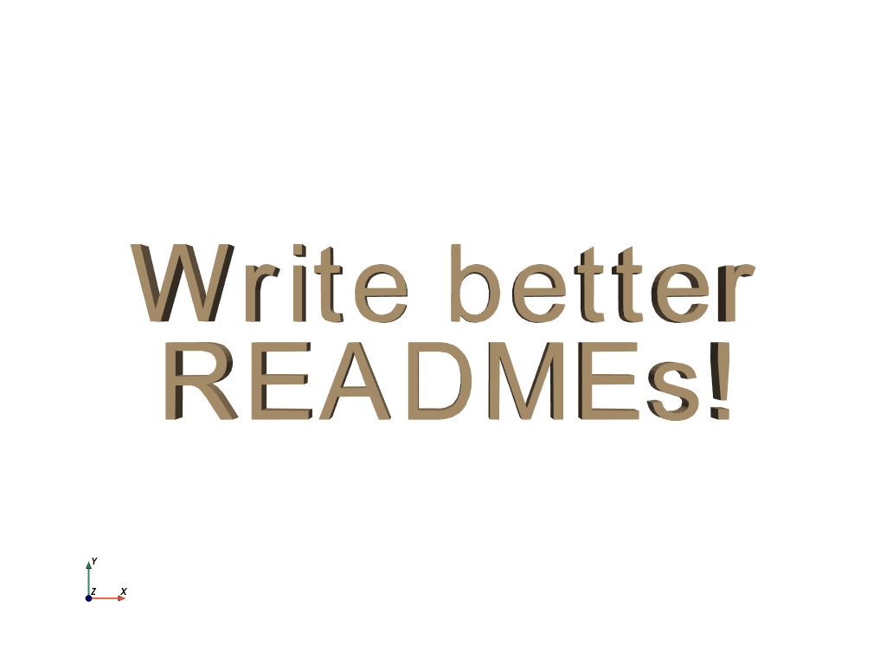

# 📄 How to write a good README

[](https://github.com/banesullivan/README/actions/workflows/spelling.yml)

> *Your documentation is a direct reflection of your software, so hold it to the same standards.*

After much practice, I have a recipe of sorts for writing READMEs that I follow anytime I make a new project. I wanted to share my process here and gather some feedback.

*This guide is geared towards projects that do not yet, or never will, have flushed out documentation. Once a project has a dedicated website, the README should turn into a minimal elevator pitch and "link fest" to relevant materials.*


## 🌟 Takeaways

- Make it inviting, friendly, and approachable
- Find the most appealing part of your software and *sell it*!
- Keep it concise; ain't nobody got time for your manifesto
- Have links to *everything* relevant (documentation, CI status, deployments, etc.)
- Emoji usage is encouraged (I'm only half kidding)
- A [template](./TEMPLATE.md) for you to use!

## ℹ️ Overview

> *If nothing else, try writing better READMEs because it will make you look more professional and legitimate.*

This all started as a bit of a joke; a coworker complimented me on a few of the READMEs I had written, wanting to learn how I do it. I jokingly said I could give a talk on the subject, and well, that's precisely what I did -- this README is the result of that talk.

In creating this guide, I hope to refine my ability to create inspiring READMEs and help my colleagues better communicate what we are creating. After all, we're in the business of Open Source Software for a reason: ***to share our work and make an impact***. Having a well-written overview of our work is crucial in pursuing that goal.

### 😊 Leave a good impression

Consider the following:

- Your README is often the first and *only* thing anyone will see about your software.
- People judge your software by your README.
- Your README is shipped alongside your code within package managers.

In many people's minds, a poorly written README translates to poorly written software. Your README should convey the quality of your work, your expertise on the matter and get users excited by what you have done.

> *At the end of the day, your README is often the best marketing material you have.*

Additionally, try to gear your README towards the average user. Assume some first-year Computer Science student is looking at your documentation wondering if coding is for them. Show them and the world what can be done with quality software and make them feel like your software is approachable.


### ⌛ Be considerate of people's time

When someone looks over your README, they should be able to find the answers to these questions quickly:

1. Does this solve my problem?
2. Can I use this code?
3. How can I learn more?

Try to streamline your README so that anyone glancing at it can answer those questions. This requires a bit of foresight into the typical kinds of problems people will come to your software for -- figure out those common problems and demonstrate a solution (even if that problem isn't the central aspect of your software).

On my point about emoji usage in the Takeaways: besides being friendly and quirky, you can use emojis to break up otherwise plain text. In most of my READMEs, I like to use emojis in the section headers. This makes it much easier for me, and hopefully, others, to navigate the document.


### 🎁 Template

Are you sold yet? Check out the included [template](./TEMPLATE.md) to get started for your project!


## 🚀 Usage instructions

> *Show off what your software looks like in action! Try to limit it to one-liners if possible and don't delve into API specifics.*

This is where you need to give *minimal* examples on how to use your software to demonstrate what it can do. I often find that screenshots are one of the most effective ways to communicate what your software can do, as most people just skim looking at the pictures.

When adding code, it is crucial to use proper formatting in code blocks with syntax highlighting:

```py
import pyvista as pv

text = pv.Text3D('Write better\n READMEs!')
text.plot(cpos='xy')
```



It can be tempting to document your entire API in the README, and many projects have done a fantastic job of this like [`tqdm`](https://github.com/tqdm/tqdm/blob/fc69d5dcf578f7c7986fa76841a6b793f813df35/README.rst), but I'd like to mostly discourage this and gear you towards writing actual documentation and leaving the README as an elevator pitch.


## ⬇️ Installation instructions

> *You may be inclined to add development instructions here, **but don't**.*

Having simple, understandable installation instructions is one of **the most important** things to get right in your README. Think about the audience you are going for and try to put yourself in their shoes: *"what is a `git clone`?"*, *"is a PyPI edible?"*, *"who is this whale named Docker?"*, etc.

Most of the time, all you want to do here is show the one-liner to install your project using the relevant package manager:

```bash
pip install pyvista
```

I'm assuming that you are shipping your software off to some package manager; if so, you've made it clear that you intend to reach a wide range of users who likely aren't interested in contributing back to your software. With that in mind, save your development instructions (e.g., `git clone ...; cmake ..`) for the bottom of your README or another document altogether. The people looking for that know how to find it, whereas your average user will be scared off by complicated build instructions.


## 🏆 Examples that inspire me

These are a few projects that I think have very effective READMEs. You look at the README and you can quickly gain what you need to answer the three questions I posed earlier.

There are countless others like these out there, but here are a few I strive to be like:

- [fatiando/pooch](https://github.com/fatiando/pooch)
- [Kitware/ITK](https://github.com/Kitware/ITK)
- [gruns/furl](https://github.com/gruns/furl)
- [marcomusy/vedo](https://github.com/marcomusy/vedo)
- [nschloe/meshio](https://github.com/nschloe/meshio)
- [mher/flower](https://github.com/mher/flower)
- [giampaolo/psutil](https://github.com/giampaolo/psutil)
- [ahupp/python-magic](https://github.com/ahupp/python-magic)
- [curvenote/components](https://github.com/curvenote/components)
- [MonitorControl/MonitorControl](https://github.com/MonitorControl/MonitorControl)


I know you're all looking for an example of a bad README now, so check out [py-filelock](https://github.com/tox-dev/py-filelock/tree/5a39bbb628d573b3776c88aa7dbfed4000a17a09) which only has a link to API docs -- no overview or anything 🤦‍♂️. I feel a little bad calling out a specific project, but you know what, I'm trying to make a point.


## 💭 Invite users to give feedback

If you found this guide insightful or if you have suggestions, please start a [Discussion](https://github.com/banesullivan/README/discussions)!

When making open source software, you share your work with the world. Whether that is in the hope of contributions back, humbly if just one other person out there finds it useful, or building a community, I think it is important to solicit engagement. To do this, I like to point people over to the Discussions tab or invite them to request new features by opening an issue.


## 📖 Further reading

- https://github.com/hackergrrl/art-of-readme
- https://www.giacomodebidda.com/posts/how-to-write-a-killer-readme/
